# XTF - Excel To Feishu 真实架构设计图

## 📋 项目概览

**XTF (Excel To Feishu)** 是一个企业级的本地 Excel 表格到飞书平台的智能同步工具，支持多维表格和电子表格两种目标平台，具备四种同步模式，智能字段管理、类型转换、频率控制、重试机制等企业级功能特性。

---

## 🏗️ 真实架构总览

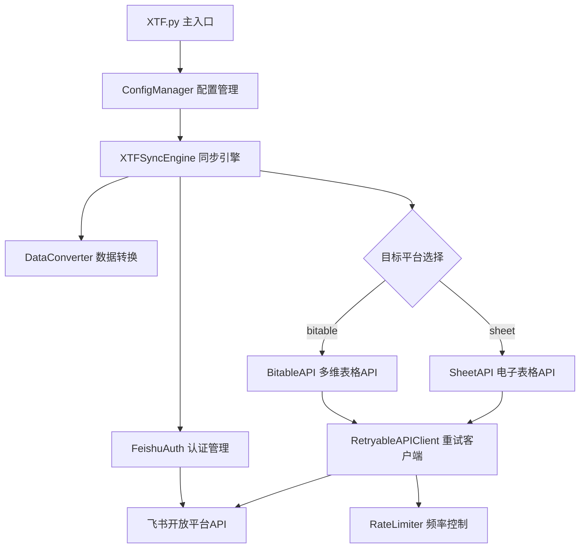
```mermaid
graph TB
    A[XTF.py 主入口] --> B[ConfigManager 配置管理]
    B --> C[XTFSyncEngine 同步引擎]
    C --> D[FeishuAuth 认证管理]
    C --> E[DataConverter 数据转换]
    C --> F{目标平台选择}
    
    F -->|bitable| G[BitableAPI 多维表格API]
    F -->|sheet| H[SheetAPI 电子表格API]
    
    G --> I[RetryableAPIClient 重试客户端]
    H --> I
    I --> J[RateLimiter 频率控制]
    
    D --> K[飞书开放平台API]
    I --> K
```

---

## 📁 模块结构分析

### 核心模块组成

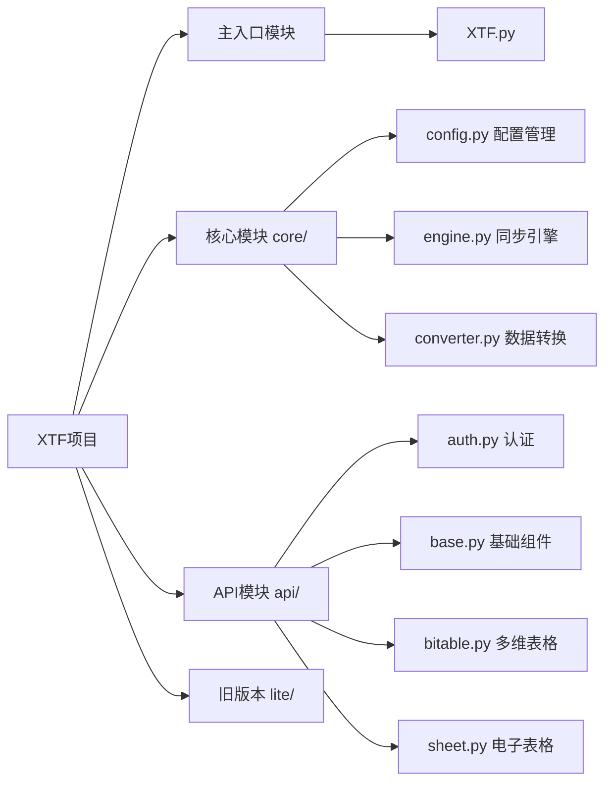
```mermaid
graph LR
    A[XTF项目] --> B[主入口模块]
    A --> C[核心模块 core/]
    A --> D[API模块 api/]
    A --> E[旧版本 lite/]
    
    B --> F[XTF.py]
    
    C --> G[config.py 配置管理]
    C --> H[engine.py 同步引擎]
    C --> I[converter.py 数据转换]
    
    D --> J[auth.py 认证]
    D --> K[base.py 基础组件]
    D --> L[bitable.py 多维表格]
    D --> M[sheet.py 电子表格]
```

---

## 🔧 配置管理系统

### 配置层级与优先级

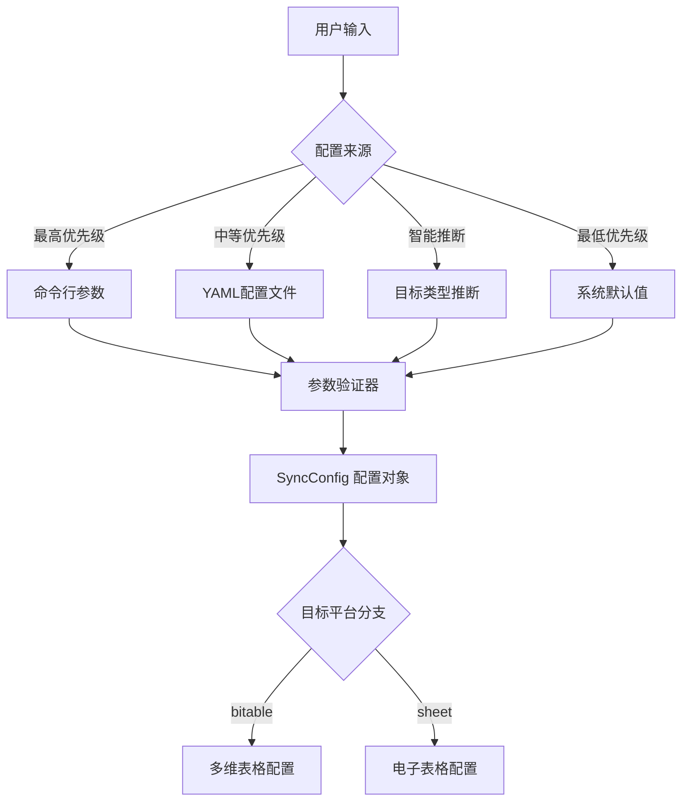
```mermaid
graph TD
    A[用户输入] --> B{配置来源}
    B -->|最高优先级| C[命令行参数]
    B -->|中等优先级| D[YAML配置文件]
    B -->|智能推断| E[目标类型推断]
    B -->|最低优先级| F[系统默认值]
    
    C --> G[参数验证器]
    D --> G
    E --> G
    F --> G
    
    G --> H[SyncConfig 配置对象]
    H --> I{目标平台分支}
    I -->|bitable| J[多维表格配置]
    I -->|sheet| K[电子表格配置]
```

### 配置对象结构

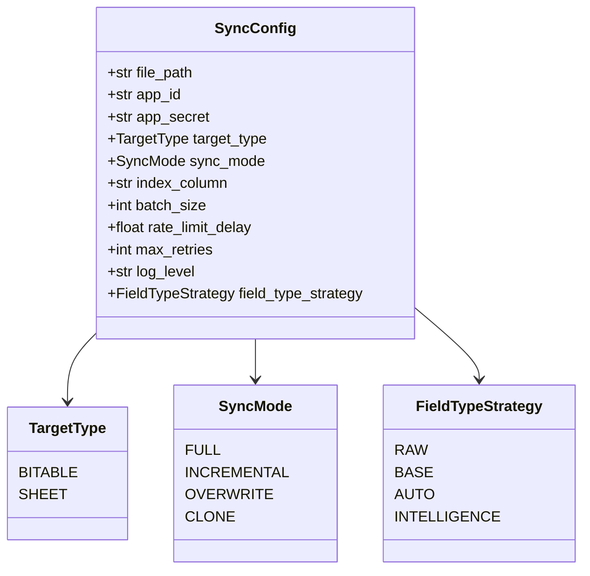
```mermaid
classDiagram
    class SyncConfig {
        +str file_path
        +str app_id
        +str app_secret
        +TargetType target_type
        +SyncMode sync_mode
        +str index_column
        +int batch_size
        +float rate_limit_delay
        +int max_retries
        +str log_level
        +FieldTypeStrategy field_type_strategy
    }
    
    class TargetType {
        BITABLE
        SHEET
    }
    
    class SyncMode {
        FULL
        INCREMENTAL
        OVERWRITE
        CLONE
    }
    
    class FieldTypeStrategy {
        RAW
        BASE
        AUTO
        INTELLIGENCE
    }
    
    SyncConfig --> TargetType
    SyncConfig --> SyncMode
    SyncConfig --> FieldTypeStrategy
```

---

## 🚀 同步引擎架构

### 引擎初始化流程

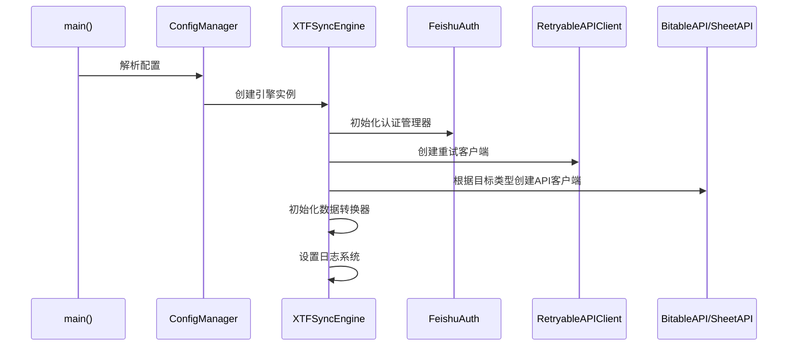
```mermaid
sequenceDiagram
    participant M as main()
    participant CM as ConfigManager
    participant XSE as XTFSyncEngine
    participant FA as FeishuAuth
    participant RAC as RetryableAPIClient
    participant API as BitableAPI/SheetAPI
    
    M->>CM: 解析配置
    CM->>XSE: 创建引擎实例
    XSE->>FA: 初始化认证管理器
    XSE->>RAC: 创建重试客户端
    XSE->>API: 根据目标类型创建API客户端
    XSE->>XSE: 初始化数据转换器
    XSE->>XSE: 设置日志系统
```

### 同步模式执行流程

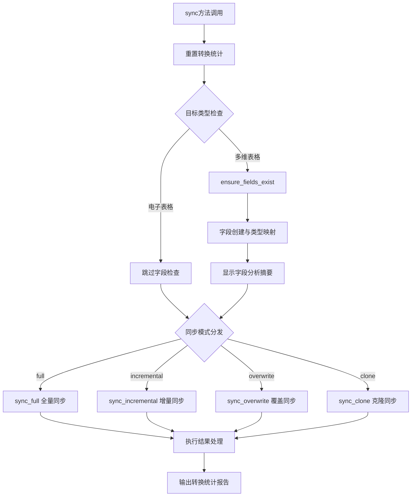
```mermaid
flowchart TD
    A[sync方法调用] --> B[重置转换统计]
    B --> C{目标类型检查}
    
    C -->|多维表格| D[ensure_fields_exist]
    C -->|电子表格| E[跳过字段检查]
    
    D --> F[字段创建与类型映射]
    F --> G[显示字段分析摘要]
    
    E --> H{同步模式分发}
    G --> H
    
    H -->|full| I[sync_full 全量同步]
    H -->|incremental| J[sync_incremental 增量同步]
    H -->|overwrite| K[sync_overwrite 覆盖同步]
    H -->|clone| L[sync_clone 克隆同步]
    
    I --> M[执行结果处理]
    J --> M
    K --> M
    L --> M
    
    M --> N[输出转换统计报告]
```

---

## 🧠 智能字段类型系统

### 字段类型策略架构

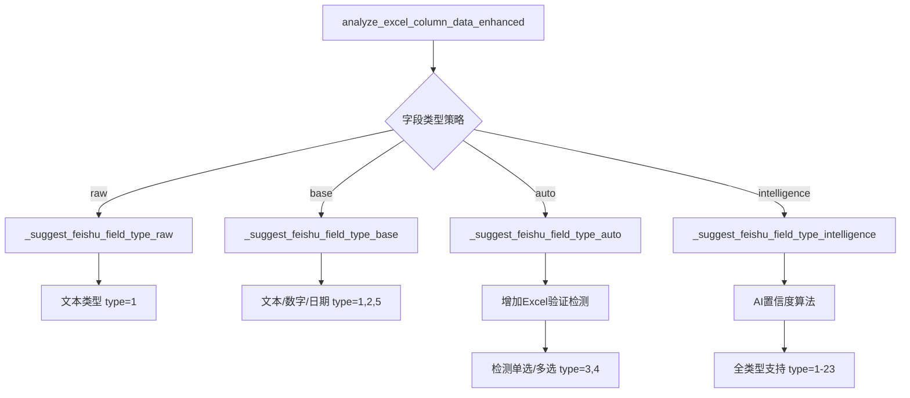
```mermaid
graph TB
    A[analyze_excel_column_data_enhanced] --> B{字段类型策略}
    
    B -->|raw| C[_suggest_feishu_field_type_raw]
    B -->|base| D[_suggest_feishu_field_type_base]
    B -->|auto| E[_suggest_feishu_field_type_auto]
    B -->|intelligence| F[_suggest_feishu_field_type_intelligence]
    
    C --> G[文本类型 type=1]
    D --> H[文本/数字/日期 type=1,2,5]
    E --> I[增加Excel验证检测]
    F --> J[AI置信度算法]
    
    I --> K[检测单选/多选 type=3,4]
    J --> L[全类型支持 type=1-23]
```

### 数据类型检测机制

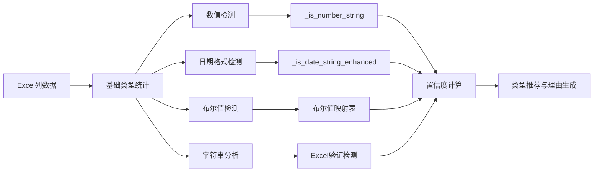
```mermaid
flowchart LR
    A[Excel列数据] --> B[基础类型统计]
    B --> C[数值检测]
    B --> D[日期格式检测]
    B --> E[布尔值检测]
    B --> F[字符串分析]
    
    C --> G[_is_number_string]
    D --> H[_is_date_string_enhanced]
    E --> I[布尔值映射表]
    F --> J[Excel验证检测]
    
    G --> K[置信度计算]
    H --> K
    I --> K
    J --> K
    
    K --> L[类型推荐与理由生成]
```

---

## 🌐 API层架构

### 认证与请求管理

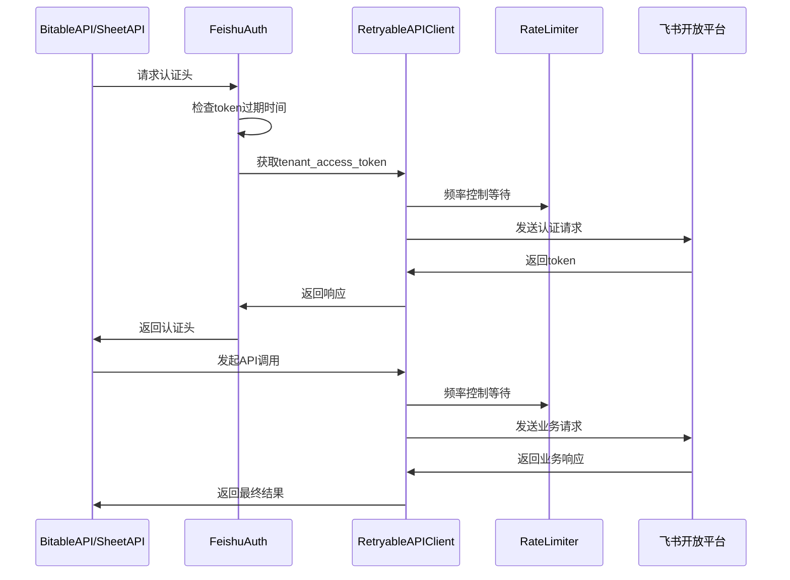
```mermaid
sequenceDiagram
    participant API as BitableAPI/SheetAPI
    participant Auth as FeishuAuth
    participant Client as RetryableAPIClient
    participant Limiter as RateLimiter
    participant Feishu as 飞书开放平台
    
    API->>Auth: 请求认证头
    Auth->>Auth: 检查token过期时间
    Auth->>Client: 获取tenant_access_token
    Client->>Limiter: 频率控制等待
    Client->>Feishu: 发送认证请求
    Feishu->>Client: 返回token
    Client->>Auth: 返回响应
    Auth->>API: 返回认证头
    
    API->>Client: 发起API调用
    Client->>Limiter: 频率控制等待
    Client->>Feishu: 发送业务请求
    Feishu->>Client: 返回业务响应
    Client->>API: 返回最终结果
```

### 重试机制实现

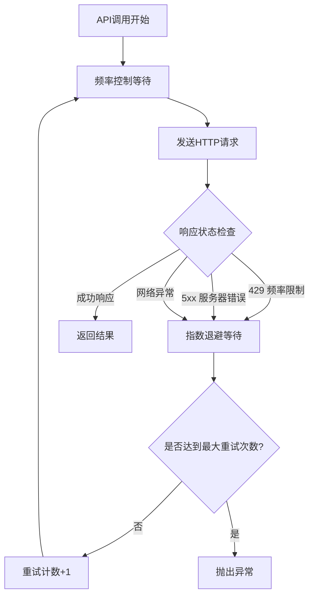
```mermaid
flowchart TD
    A[API调用开始] --> B[频率控制等待]
    B --> C[发送HTTP请求]
    C --> D{响应状态检查}
    
    D -->|429 频率限制| E[指数退避等待]
    D -->|5xx 服务器错误| E
    D -->|网络异常| E
    D -->|成功响应| F[返回结果]
    
    E --> G{是否达到最大重试次数?}
    G -->|否| H[重试计数+1]
    G -->|是| I[抛出异常]
    
    H --> B
```

---

## 📊 数据转换系统

### 转换器架构设计

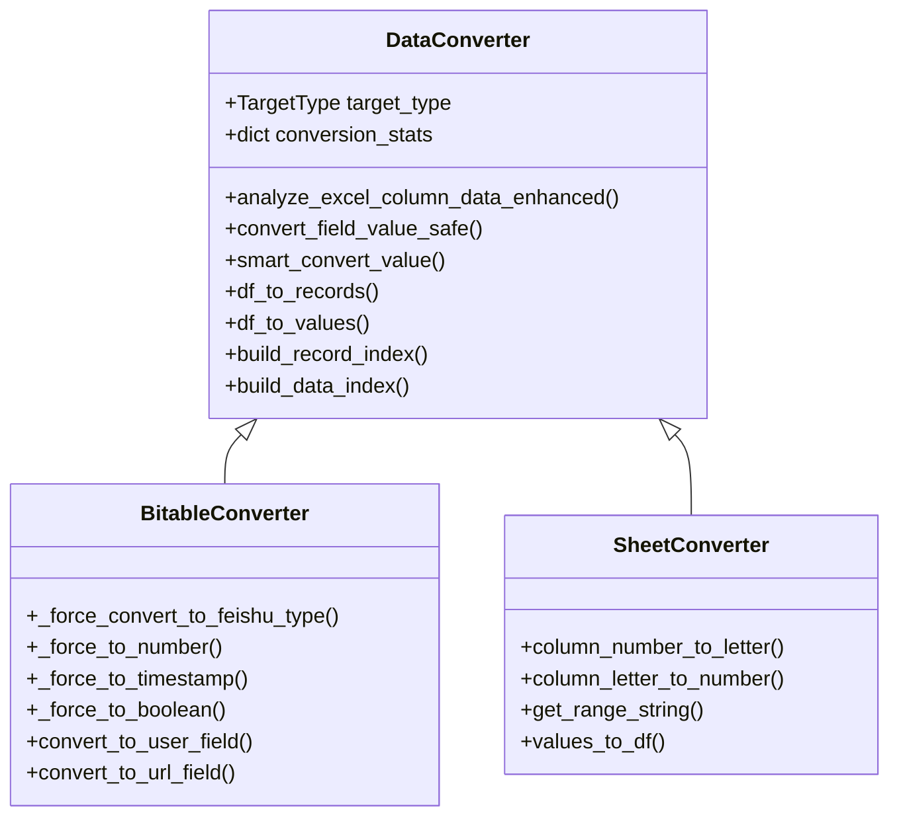
```mermaid
classDiagram
    class DataConverter {
        +TargetType target_type
        +dict conversion_stats
        +analyze_excel_column_data_enhanced()
        +convert_field_value_safe()
        +smart_convert_value()
        +df_to_records()
        +df_to_values()
        +build_record_index()
        +build_data_index()
    }
    
    class BitableConverter {
        +_force_convert_to_feishu_type()
        +_force_to_number()
        +_force_to_timestamp()
        +_force_to_boolean()
        +convert_to_user_field()
        +convert_to_url_field()
    }
    
    class SheetConverter {
        +column_number_to_letter()
        +column_letter_to_number()
        +get_range_string()
        +values_to_df()
    }
    
    DataConverter <|-- BitableConverter
    DataConverter <|-- SheetConverter
```

### 强制类型转换流程

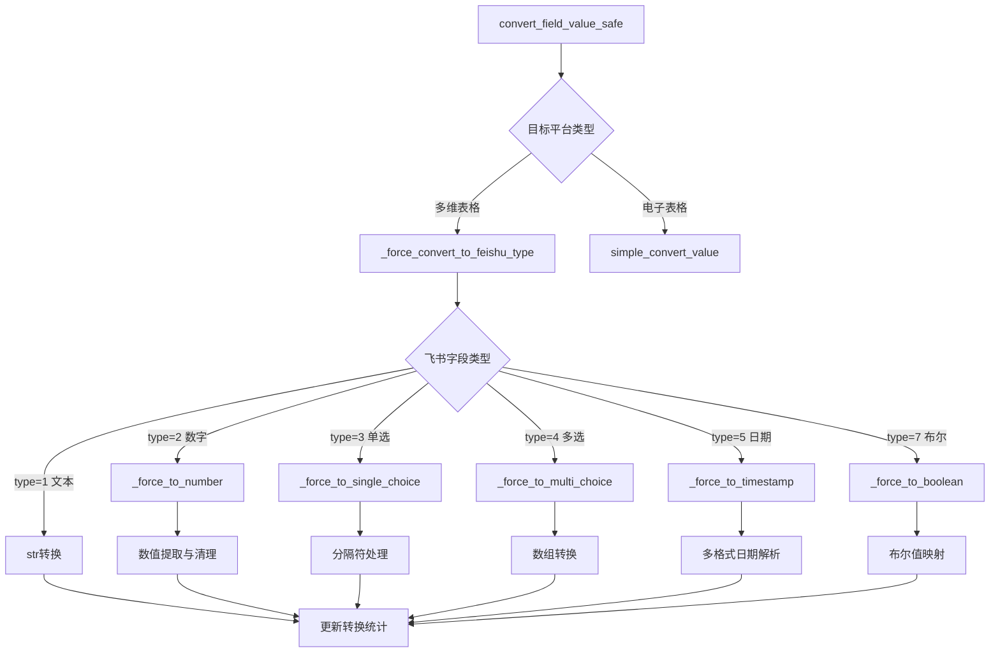
```mermaid
flowchart TD
    A[convert_field_value_safe] --> B{目标平台类型}
    
    B -->|多维表格| C[_force_convert_to_feishu_type]
    B -->|电子表格| D[simple_convert_value]
    
    C --> E{飞书字段类型}
    E -->|type=1 文本| F[str转换]
    E -->|type=2 数字| G[_force_to_number]
    E -->|type=3 单选| H[_force_to_single_choice]
    E -->|type=4 多选| I[_force_to_multi_choice]
    E -->|type=5 日期| J[_force_to_timestamp]
    E -->|type=7 布尔| K[_force_to_boolean]
    
    G --> L[数值提取与清理]
    H --> M[分隔符处理]
    I --> N[数组转换]
    J --> O[多格式日期解析]
    K --> P[布尔值映射]
    
    F --> Q[更新转换统计]
    L --> Q
    M --> Q
    N --> Q
    O --> Q
    P --> Q
```

---

## 🔄 四种同步模式实现

### 全量同步 (Full Sync)

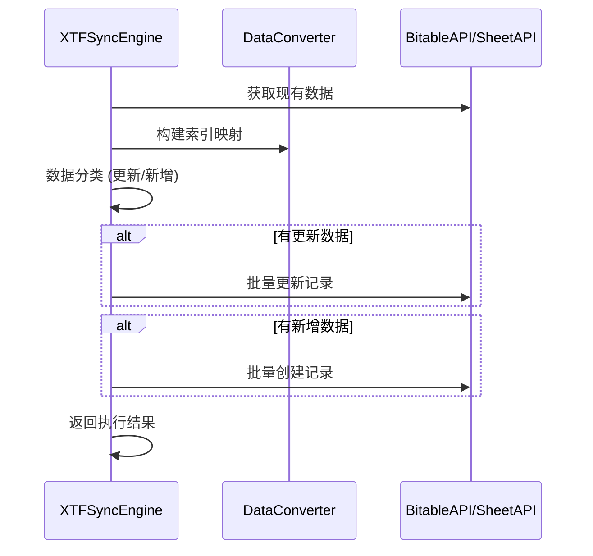
```mermaid
sequenceDiagram
    participant Engine as XTFSyncEngine
    participant Converter as DataConverter
    participant API as BitableAPI/SheetAPI
    
    Engine->>API: 获取现有数据
    Engine->>Converter: 构建索引映射
    Engine->>Engine: 数据分类 (更新/新增)
    
    alt 有更新数据
        Engine->>API: 批量更新记录
    end
    
    alt 有新增数据
        Engine->>API: 批量创建记录
    end
    
    Engine->>Engine: 返回执行结果
```

### 增量同步 (Incremental Sync)

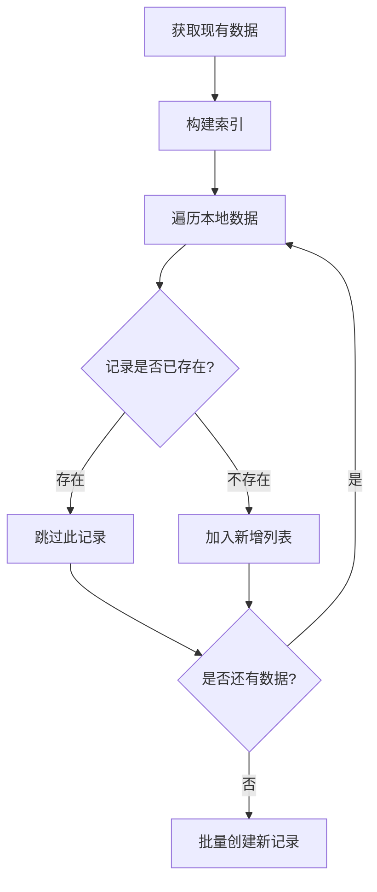
```mermaid
flowchart TD
    A[获取现有数据] --> B[构建索引]
    B --> C[遍历本地数据]
    C --> D{记录是否已存在?}
    D -->|存在| E[跳过此记录]
    D -->|不存在| F[加入新增列表]
    E --> G{是否还有数据?}
    F --> G
    G -->|是| C
    G -->|否| H[批量创建新记录]
```

### 覆盖同步 (Overwrite Sync)

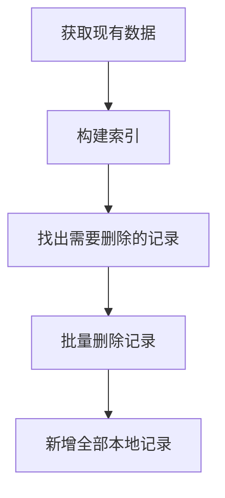
```mermaid
flowchart TD
    A[获取现有数据] --> B[构建索引]
    B --> C[找出需要删除的记录]
    C --> D[批量删除记录]
    D --> E[新增全部本地记录]
```

### 克隆同步 (Clone Sync)

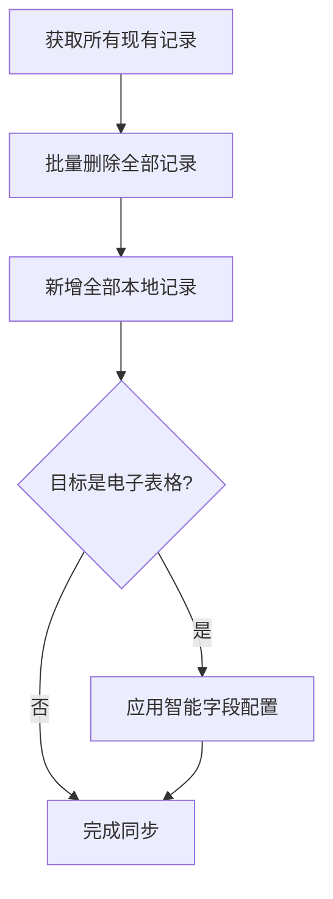
```mermaid
flowchart TD
    A[获取所有现有记录] --> B[批量删除全部记录]
    B --> C[新增全部本地记录]
    C --> D{目标是电子表格?}
    D -->|是| E[应用智能字段配置]
    D -->|否| F[完成同步]
    E --> F
```

---

## 🛡️ 错误处理与稳定性

### 多层错误处理机制

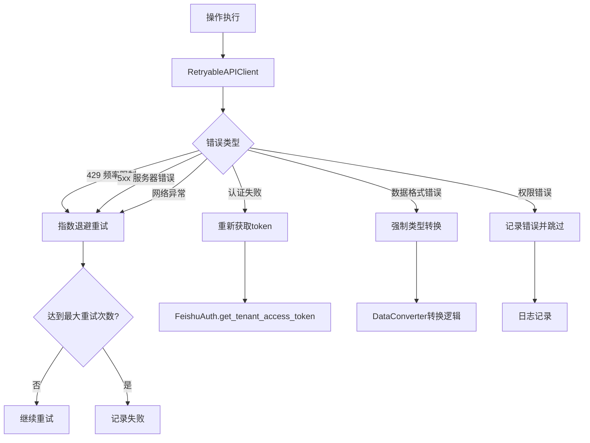
```mermaid
graph TB
    A[操作执行] --> B[RetryableAPIClient]
    B --> C{错误类型}
    
    C -->|429 频率限制| D[指数退避重试]
    C -->|5xx 服务器错误| D
    C -->|网络异常| D
    C -->|认证失败| E[重新获取token]
    C -->|数据格式错误| F[强制类型转换]
    C -->|权限错误| G[记录错误并跳过]
    
    D --> H{达到最大重试次数?}
    H -->|否| I[继续重试]
    H -->|是| J[记录失败]
    
    E --> K[FeishuAuth.get_tenant_access_token]
    F --> L[DataConverter转换逻辑]
    G --> M[日志记录]
```

### 转换统计与质量监控

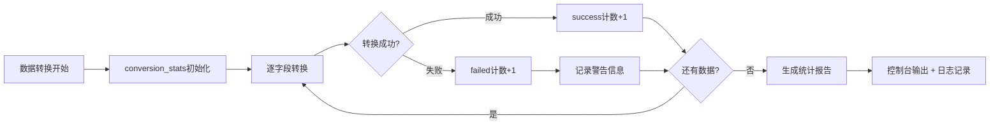
```mermaid
flowchart LR
    A[数据转换开始] --> B[conversion_stats初始化]
    B --> C[逐字段转换]
    C --> D{转换成功?}
    D -->|成功| E[success计数+1]
    D -->|失败| F[failed计数+1]
    F --> G[记录警告信息]
    E --> H{还有数据?}
    G --> H
    H -->|是| C
    H -->|否| I[生成统计报告]
    I --> J[控制台输出 + 日志记录]
```

---

## 📈 性能优化策略

### 批处理机制

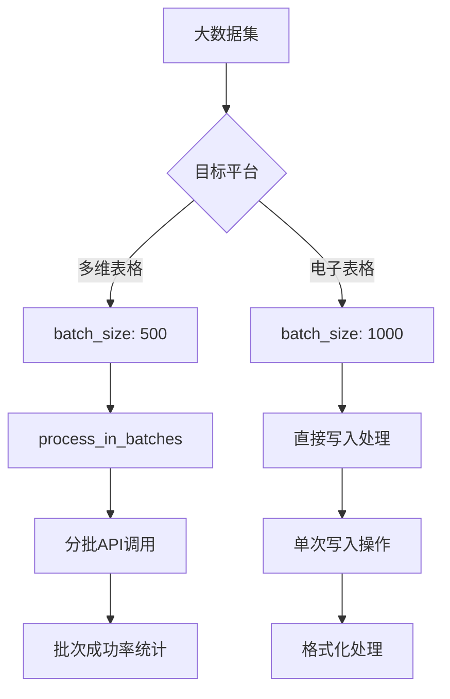
```mermaid
graph TB
    A[大数据集] --> B{目标平台}
    B -->|多维表格| C[batch_size: 500]
    B -->|电子表格| D[batch_size: 1000]
    
    C --> E[process_in_batches]
    D --> F[直接写入处理]
    
    E --> G[分批API调用]
    G --> H[批次成功率统计]
    
    F --> I[单次写入操作]
    I --> J[格式化处理]
```

### 频率控制与重试

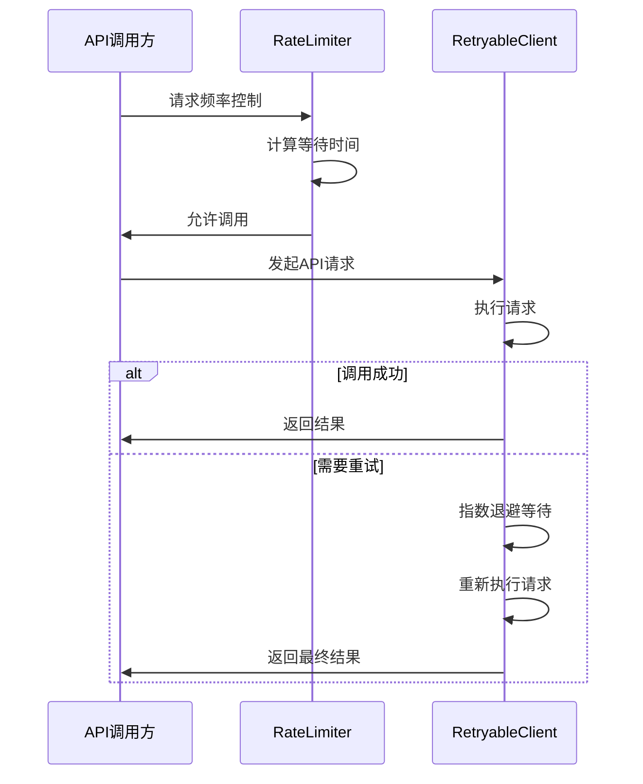
```mermaid
sequenceDiagram
    participant API as API调用方
    participant RL as RateLimiter
    participant RC as RetryableClient
    
    API->>RL: 请求频率控制
    RL->>RL: 计算等待时间
    RL->>API: 允许调用
    
    API->>RC: 发起API请求
    RC->>RC: 执行请求
    
    alt 调用成功
        RC->>API: 返回结果
    else 需要重试
        RC->>RC: 指数退避等待
        RC->>RC: 重新执行请求
        RC->>API: 返回最终结果
    end
```

---

## 📝 日志与监控系统

### 日志层级设计

```mermaid
graph LR
    A[日志系统] --> B[控制台输出]
    A --> C[文件日志]
    
    B --> D[实时进度显示]
    B --> E[关键信息提示]
    B --> F[错误警告]
    
    C --> G[详细操作记录]
    C --> H[调试信息]
    C --> I[异常堆栈]
    
    G --> J[logs/xtf_YYYYMMDD_HHMMSS.log]
```

### 统计报告生成

```mermaid
flowchart TD
    A[同步完成] --> B[收集转换统计]
    B --> C[计算成功率]
    B --> D[分析失败原因]
    B --> E[生成优化建议]
    
    C --> F[成功/失败比例]
    D --> G[错误类型分类]
    E --> H[数据质量建议]
    
    F --> I[控制台摘要输出]
    G --> I
    H --> I
    
    I --> J[详细日志记录]
```

---

## 💡 真实架构特点总结

### 1. 模块化设计
- **配置管理**: 独立的ConfigManager处理多源配置
- **认证管理**: 专用的FeishuAuth管理token生命周期
- **网络层**: RetryableAPIClient + RateLimiter 提供稳定的网络访问
- **数据转换**: DataConverter 统一处理两种平台的数据格式差异

### 2. 策略模式应用
- **字段类型策略**: raw/base/auto/intelligence 四种策略
- **同步模式**: full/incremental/overwrite/clone 四种模式
- **目标平台**: bitable/sheet 两种平台统一接口

### 3. 错误处理与稳定性
- **三层重试机制**: 网络层重试 + API层重试 + 业务层容错
- **频率控制**: 遵守飞书API调用限制
- **数据转换容错**: 强制类型转换保证数据同步成功率

### 4. 企业级特性
- **详细的日志记录**: 分级日志 + 文件存档
- **批处理优化**: 针对不同平台的批次大小优化
- **配置灵活性**: 命令行 + 配置文件 + 智能推断
- **统计报告**: 转换成功率统计与质量分析

这个架构图准确反映了您的XTF项目的真实设计思路，没有添加任何不存在的功能，完全基于实际代码分析得出。